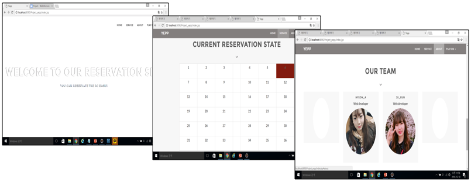
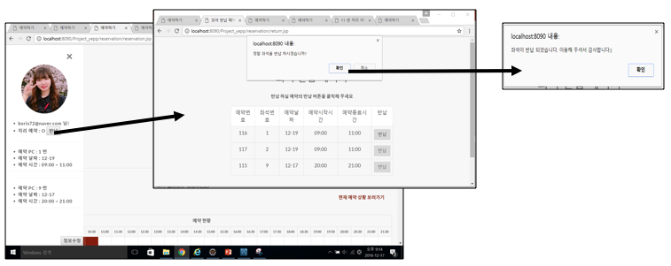

# yepp



## 소개
`성신여자대학교 IT학부의 프로그래밍실 좌석 예약 웹 서비스`입니다.

## 개발환경


## 개발인원
* [권현아](https://github.com/kwonhyeona)
* [이지은](https://github.com/Leejieun3001)

## 주요기능
* MVC 패턴 기반으로 모델과 뷰를 분리하고 주요 로직은 컨트롤러에 구현
* 메일 관련 라이브러리를 이용해 아이디 찾기 구현
* jdbc를 이용해 MySQL 스키마와 연결
* bootstrap, fontawesome 을 이용해 반응형 웹 디자인
* 쿠키와 세션을 이용해 정보 유지
* PreparedStatement, Statement 이용해 쿼리 설정

## 주요코드
```java
/*
  DB Connection 예제입니다.
  DButil 클래스에 static 함수로 구현해놓고 실제 컨트롤러인 Servlet 파일에서 호출합니다.
*/
public class ReservationDButil {
  static Statement stmt = null;
	static PreparedStatement pstmt = null;
  
  public static boolean insertReserDB(Connection con, Reservation reservation) {
		String sql = "insert into reservation(user_id, seat_id, start_time, end_time, reser_date) values(?,?,?,?,?)";

		try {
			pstmt = con.prepareStatement(sql);
			pstmt.setString(1, reservation.getUser_id());
			pstmt.setInt(2, reservation.getSeat_id());
			pstmt.setString(3, reservation.getStart_time());
			pstmt.setString(4, reservation.getEnd_time());
			pstmt.setString(5, reservation.getReser_date());
			pstmt.executeUpdate();
			System.out.println("reservationDButil.java : db insert 성공");
		} catch (Exception e) {
			System.out.println("reservationDButil.java : db insert 실패 ");
			e.printStackTrace();
			System.out.println(e.getMessage());
			return false;
		}

		return true;
	}
}


@WebServlet("/doReservationServlet")
public class ReservationServlet extends HttpServlet {
    ...

    protected void doPost(HttpServletRequest request, HttpServletResponse response) throws ServletException, IOException {
        ServletContext sc = getServletContext();
        Connection conn = (Connection) sc.getAttribute("DBconnection");

        request.setCharacterEncoding("utf-8");
        response.setContentType("text/html;charset=UTF-8");
        
        boolean isCompleteReservation = ReservationDButil.insertReserDB(conn, new_reser);
        
        if (isCompleteReservation) System.out.println(" ReservationServlet.java :예약 성공");
        else System.out.println(" ReservationServlet.java :DB입력 실패");
        ...
    }
}
```

```java
/*
  세션 사용 예제입니다.
*/
@WebServlet("/doEdit")
public class EditServlet extends HttpServlet {
    ...
    protected void doPost(HttpServletRequest request, HttpServletResponse response) throws ServletException, IOException {
        // TODO Auto-generated method stub
        ...
        HttpSession session = request.getSession();
        session.setAttribute("complete", "true");
    }
    ...
}
```

```jsp
// HTML 코드 안에 <% .. %> 태그를 사용해 스크립트 영역 추가
<body id="page-top" data-spy="scroll" data-target=".navbar-custom"
	onload="login()">
	<%
		ArrayList<String[]> my_seat_list = (ArrayList<String[]>) session.getAttribute("mySeatList");
		if (my_seat_list.size() > 0) session.setAttribute("reser_seat", "O");
		else session.setAttribute("reser_seat", "X");
	%>
  ...
</body>
```
